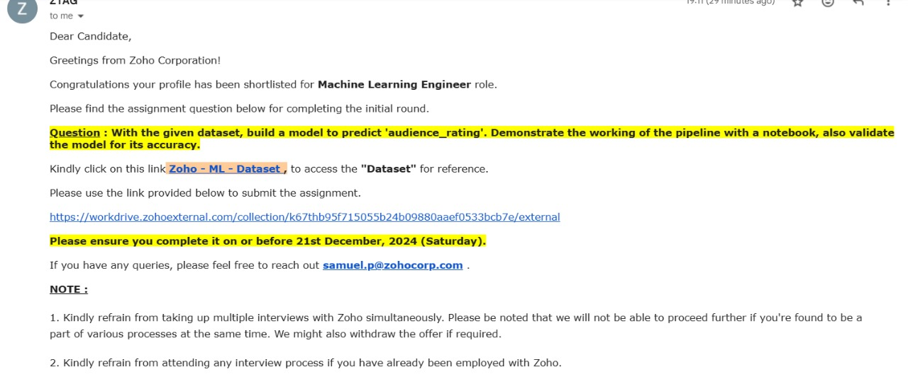

# Rotten Tomatoes Audience Rating Prediction

## Setup

1. Create a virtual environment:

   ```sh
   python -m venv venv
   ```
2. Activate the virtual environment:

   - On Windows:
     ```sh
     venv\Scripts\activate
     ```
   - On macOS and Linux:
     ```sh
     source venv/bin/activate
     ```
3. Install the required dependencies:

   ```sh
   pip install -r requirements.txt
   ```
4. Run the Jupyter notebook:

   ```sh
   jupyter notebook
   ```


